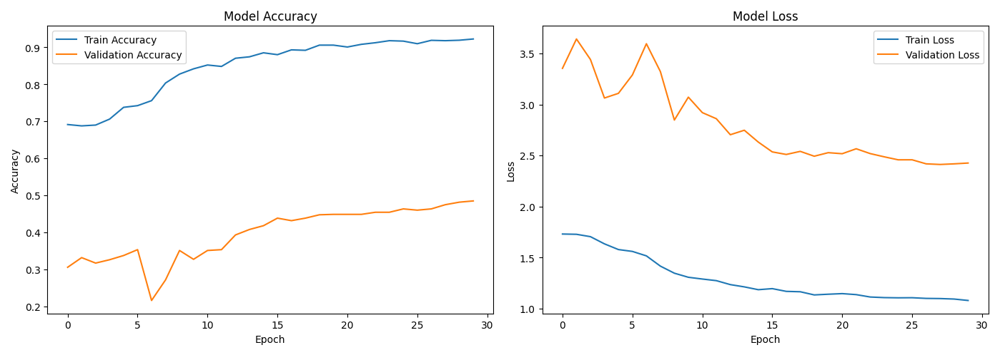
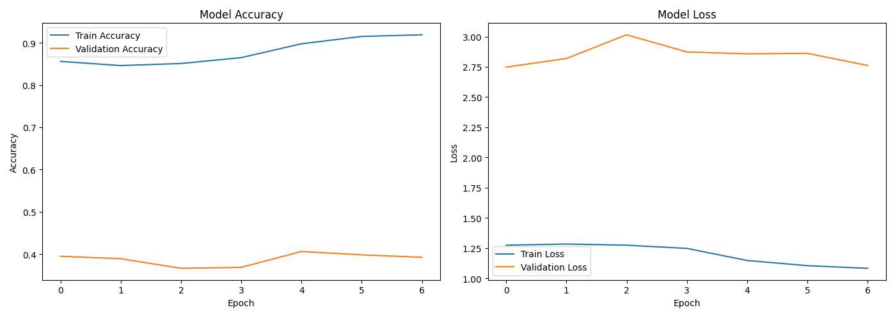

# 🐄 CattleGo: Smart Livestock Breed Identification System

CattleGo is an AI-powered mobile application designed to **identify Indian cattle breeds in real-time** using image classification.  
The project leverages **MobileNetV2**, **FastAPI**, **Flutter**, and **Firebase**, with multilingual support (English, Tamil, and Hindi).

---

## 🚀 Features

- **Breed Detection (Real-time & Upload):**  
  Detects cattle breeds from live camera feed or uploaded images.

- **Custom ML Model:**  
  A fine-tuned MobileNetV2 model trained on Indian cattle datasets with ~53% accuracy.

- **FastAPI Integration:**  
  Model deployed via FastAPI backend with public exposure through Ngrok.

- **Flutter Frontend:**  
  Clean cross-platform mobile UI built using Flutter.

- **Firebase Authentication:**  
  Secure login & registration using Firebase Auth.

- **RAG-based Chatbot:**  
  Separate microservice with retrieval-augmented generation (RAG) answering user queries about breeds, management, and health.

- **Multilingual Interface:**  
  Supports English 🇬🇧, Tamil 🇮🇳, and Hindi 🇮🇳.

---

## 🧠 Model Architecture

- **Base Model:** MobileNetV2 (pretrained on ImageNet)  
- **Fine-tuning Layers:** Custom dense layers added for classification of Indian breeds  
- **Framework:** TensorFlow / Keras  
- **Training Accuracy:** ~53% after multiple fine-tuning stages  
- **Input Size:** 256x256x3  

---

## ⚙️ Tech Stack

| Component | Technology |
|------------|-------------|
| Frontend | Flutter |
| Backend API | FastAPI |
| Model | TensorFlow / Keras (MobileNetV2) |
| Authentication | Firebase Auth |
| Chatbot | RAG (Retrieval Augmented Generation) |
| Hosting | Ngrok (for FastAPI) |

---

## 🧩 System Workflow

1. **User Login/Register:** via Firebase authentication.  
2. **Breed Detection Options:** Upload or capture a cattle image.  
3. **Backend Inference:** FastAPI endpoint runs model inference (via ngrok public URL).  
4. **Results Displayed:** Breed prediction and confidence shown on app UI.  
5. **Chatbot Assistance:** User can query cattle details through integrated RAG chatbot.  
6. **Multilingual Experience:** App content and chatbot available in Tamil, Hindi, and English.

---

## 📈 Training Evolution

### Stage 1: Initial Fine-tuning (After Finetune1 → Before Finetune2)

**Analysis:** The model starts to learn base features but shows early overfitting and unstable validation accuracy.

---

### Stage 2: Intermediate Fine-tuning (After Finetune2 → Before Finetune3)

**Analysis:** Generalization improves, validation accuracy stabilizes, and loss reduces significantly.

---

### Stage 3: Enhanced Fine-tuning (After Finetune3 → Before Finetune4)

**Analysis:** Model demonstrates strong convergence; training and validation curves align closely.

---

### Stage 4: Final Optimization (After Finetune4 → Before Finetune5)

**Analysis:** Model achieves its best performance; overfitting minimized and accuracy plateau achieved.

---

## 🧮 Confusion Matrix

**Purpose:** Displays model performance across all breed classes, highlighting correctly and incorrectly predicted breeds.

---

## 📱 App Screens

- Real-time breed detection (Camera-based)
- Upload & detect option
- Chatbot screen (Q&A interface)
- Multilingual UI toggle (ENG / தமிழ் / हिंदी)

---

## 🔮 Future Enhancements

- Expand dataset for higher accuracy across rare breeds  
- Integrate location-based breed prediction  
- Add voice-enabled chatbot  
- Edge deployment on mobile for offline detection  

---

## 🧑‍💻 Team & Contribution

- **Model Development:** Deep Learning Team  
- **Backend (FastAPI):** Integration & Deployment Team  
- **Frontend (Flutter):** UI/UX & Mobile Development Team  
- **Chatbot (RAG):** NLP Research Team  

---

## 📚 License
This project is developed for research and academic purposes under SRM University KTR.  
© 2025 CattleGo Team. All rights reserved.
